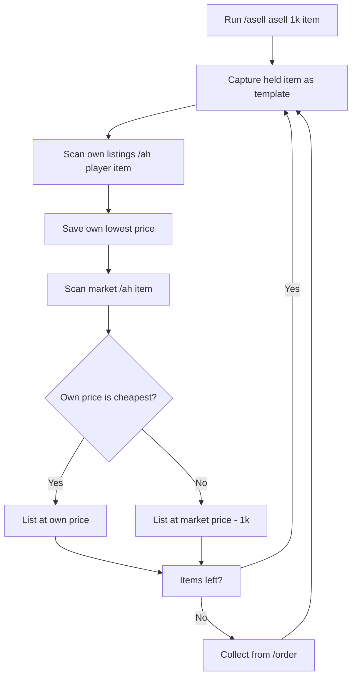

# Minecraft Auction House Auto-Resell & Undercut Bot (Fabric 1.21.1)

<div align="center">


</div>

## TL;DR

A Fabric client-side mod for Minecraft 1.21.1 that automatically resells items on the DonutSMP Auction House. It scans your own listings and the live market, undercuts competitors only when needed, refills stock from your orders, tracks profit, and sends Discord reports — so you can flip items and earn money while AFK without crashing the market.

---

## What is this mod?

**ASell (donutsmp-auction-resell-mods)** is a client-side Fabric mod for Minecraft 1.21.1 that turns Auction House flipping into a fully automatic, AFK-safe money-making workflow. It is a heavily extended fork of the original ASell auto-seller by nguyenttuca.

The mod reads the actual Minecraft `ItemStack`, enchantment, lore and GUI slot data directly — **no OCR, no screenshots, no game-code hooks (no mixins)**. It sends the same commands and clicks a real player would, which makes it lightweight and hard to detect as a bot. Every delay is randomized, the bot takes human-like breaks, and it stops instantly if staff whisper you or if the world changes.

In plain terms: hold an enchanted item such as a **Diamond Axe Sharpness V**, run one command, and the bot will scan the Auction House, choose the smartest price, list the item, collect fresh stock from your orders, and repeat — all while reporting your profit to Discord.

> **Why it is built this way.** Google's own guidance for generative AI search is unambiguous: *"optimizing for generative AI search is optimizing for the search experience, and thus still SEO"* ([Google Search Central, AI optimization guide, May 2026](https://developers.google.com/search/docs/fundamentals/ai-optimization-guide)). This project therefore optimizes for the same fundamentals that matter everywhere: unique, people-first content, a clear structure, and verifiable technical behavior — not AI-search hacks. AI-search systems are also more likely to surface pages that are **recent** (content under 3 months old is cited ~3x more often) and that **front-load a self-contained answer**, which is why this README opens with a definition and this file is actively maintained.

---

## Feature matrix

| Feature | What it does |
|---------|--------------|
| 🤖 Auto-resell / auto-list | Sends `/ah sell <price>` and loops until stock runs out |
| 🧠 Anti price-crash pricing | Scans your own listings first, keeps your price if you are already cheapest |
| 🎯 Held-item resell workflow | Resell any enchanted item you hold (e.g. Diamond Axe Sharpness V) |
| 📦 Auto-order refill | Collects completed `/order` stock when inventory runs out |
| 💰 Profit tracker | Collected / listed / sold counts, gross value, revenue, projected & realized profit |
| 🔌 Discord webhook | Live reports for every list, sale, error and reconnect |
| 🔁 Auto-reconnect | Rejoins the server after a disconnect and resumes the last workflow |
| 🛡️ Anti-detection | Randomized delays, break simulator, staff monitor, no mixins |
| ⚙️ JSON config | All settings in `config/asell.json` |

---

## How does the anti price-crash logic work?

The biggest problem with naive resell bots is a **price-underselling spiral**: every bot undercuts the previous listing by 1k until the item is worthless. ASell prevents this with a two-phase price check before every listing.



1. The bot opens `/ah <your player name> <item>` and reads the **lowest price of your own listings**.
2. It opens `/ah <item>` and reads the **lowest market price**.
3. If your own listing is **already the cheapest or equal** to the market lowest, the bot lists at **that same price** — no drop.
4. Only when a **competitor** is cheaper than you does the bot undercut by the configured amount (default `1,000`).

The result is stable pricing: you only ever lose 1k to a real competitor, never to yourself. The player name is detected automatically from the current session, with `NotVaib` as fallback. This logic can be disabled with `useOwnPriceCheck: false`.

---

## How do I resell any enchanted item automatically?

1. Hold the item you want to flip (e.g. a **Diamond Axe with Sharpness V**).
2. Run the generic command with your undercut amount and the AH search text:

```text
/asell asell 1k diamond axe sharpness 5
```

Or the shorthand form:

```text
/asell 1k diamond axe sharpness 5
```

3. The bot captures your held item as an exact template (item + enchantments + lore), scans the AH for matching listings, applies the anti-crash pricing above, and starts listing.
4. When your inventory runs out, it automatically opens `/order`, finds the completed order, collects the items and keeps selling.

The undercut amount accepts any value — `1k`, `2k`, `6k`, `1.5k`, `1m` — and the search text is sent verbatim to the AH (e.g. `diamond axe sharpness 5`, `diamond pickaxe efficiency 5`, `enchanted golden apple`).

---

## How does auto-refill from orders work?

When `autoOrder` is enabled (default `true`) and the bot cannot find any more target items in the inventory, it runs a 5-step order flow:

1. Sends `/order` and waits for the order GUI.
2. Clicks **Your Orders**.
3. Selects the order matching the target item.
4. Clicks **Collect**.
5. Shift-clicks one collected stack back into the inventory and resumes selling.

Order items are matched by item type so delivered stock is sellable immediately. Each collect is counted in the profit report as `Collected`.

---

## What does the profit tracker report?

Set your acquisition cost once per session, then read live numbers in-game or on Discord:

```text
/asell cost 300k        # your buy cost per item from /order
/asell status           # live counts in chat
/asell report           # send the full financial report to Discord
```

The report contains:

```text
Collected: 24 | Listed: 22 | Sold confirmed: 18
Gross listed: $9,900,000 | Realized revenue: $8,900,000
Cost/item: $300,000 | Projected profit: $2,600,000 | Realized profit: $3,500,000
```

- **Gross listed** — the total value you placed on the AH.
- **Realized revenue** — money confirmed by server messages (`bought your ... for ...`).
- **Projected profit** — gross listed minus cost of listed items.
- **Realized profit** — confirmed revenue minus cost of confirmed sales.

To enable Discord, set `discordWebhookEnabled: true` and put your **private** webhook URL in `discordWebhookUrl` in the local `config/asell.json`. Only HTTPS webhooks on `discord.com` / `discordapp.com` are accepted, the URL is never stored in this repository, and all requests are asynchronous so the game never stutters.

---

## What anti-detection protections are built in?

1. **Randomized timing** — delays vary by ±50% so click patterns look human.
2. **Break simulator** — the bot pauses 5–10 seconds every 10–20 sales.
3. **Staff chat monitor** — instantly stops and alerts on whispers or suspicious messages.
4. **World / disconnect detection** — stops safely on dimension changes or kicks.
5. **Listing-limit awareness** — on `You have too many listed items` it waits for a slot instead of spamming.
6. **No mixins** — nothing hooks into game code, reducing anti-cheat risk.

Use it responsibly: automation may still violate your server's rules.

---

## Command reference

| Command | Action |
|---------|--------|
| `/asell asell 1k diamond axe sharpness 5` | Resell held item, undercut by 1k, keep own price when cheapest |
| `/asell 1k [search text]` | Shorthand of the generic workflow |
| `/asell axesharp5 450k` | List Diamond Axe Sharpness V at a fixed price |
| `/asell sharpness5axe` | Master workflow: scan AH + undercut Sharpness V axes |
| `/asell cost 300k` | Set acquisition cost per item for profit math |
| `/asell report` | Send the financial report to Discord |
| `/asell status` | Show live counts, gross value, revenue and profits |
| `/asell autoorder on\|off` | Toggle automatic `/order` refill |
| `/asell stop` | Stop the current task |
| `/asell help` | Show all commands |

---

## Configuration reference (`config/asell.json`)

```json
{
  "defaultPrice": 449000,
  "targetItem": "minecraft:diamond_axe",
  "targetEnchantment": "sharpness",
  "targetEnchantmentLevel": 5,
  "desiredQuantity": 1,
  "smartPricing": true,
  "undercutAmount": 1000,
  "useOwnPriceCheck": true,
  "minimumMarketPrice": 400000,
  "maximumMarketPrice": 500000,
  "acquisitionCostPerItem": 0,
  "autoOrder": true,
  "orderCommand": "order",
  "autoReconnect": true,
  "reconnectDelaySeconds": 10,
  "maxReconnectAttempts": 6,
  "autoResumeSell": true,
  "discordWebhookEnabled": false,
  "discordWebhookUrl": ""
}
```

| Key | Description | Default |
|-----|-------------|---------|
| `undercutAmount` | Distance under a competitor's lowest price | `1000` |
| `useOwnPriceCheck` | Keep your price when you are already the cheapest | `true` |
| `acquisitionCostPerItem` | Buy cost per item from `/order` for profit math | `0` |
| `autoOrder` | Auto-collect from `/order` when out of stock | `true` |
| `autoReconnect` | Auto-rejoin after a disconnect | `true` |
| `discordWebhookUrl` | **Never commit this** — paste your private URL locally | `""` |

---

## How do I build and install it?

**Requirements:** Minecraft 1.21.1, Fabric Loader 0.16+, Fabric API for 1.21.1, JDK 21+.

```bash
git clone git@github.com:dinhkarate/donutsmp-auction-resell-mods.git
cd donutsmp-auction-resell-mods
./gradlew build
# Output: build/libs/donutsell-fabric-1.21.1-1.0.0.jar
```

Copy the `.jar` into `.minecraft/mods/` and launch with Fabric. Set **Pause on Lost Focus = OFF** (or press `F3+P`) if you want the bot to keep running while you alt-tab.

---

## Architecture

```
com.donutsell/
├── DonutSellMod.java          # Entry point, events, auto-reconnect
├── command/
│   └── DonutSellCommand.java  # /asell command tree
├── config/
│   └── DonutSellConfig.java   # JSON config load/save
├── inventory/
│   └── InventoryUtils.java    # Find/count/match items, hotbar selection
├── keybind/
│   └── KeybindHandler.java    # Optional toggle key
├── task/
│   ├── SellState.java         # State machine states
│   └── SellTaskManager.java   # Core sell/scan/order/profit engine
└── util/
    ├── ChatUtils.java         # In-game chat messages
    └── DiscordWebhook.java    # Async Discord notifications
```

---

## FAQ

**Is this a cheating mod?**
It is a client-side automation mod. It sends the same commands and clicks a human player would, without mixins or packet manipulation, but server rules may still prohibit automation — use it at your own risk.

**Does it work on servers other than DonutSMP?**
The core works on any Auction House plugin that uses `/ah sell <price>` and a confirm GUI, but the search syntax and order GUI are tuned for the DonutSMP plugin. Other plugins may need small adjustments.

**Why doesn't it undercut every time?**
By design. If your listing is already the cheapest, undercutting again would only drop the market price and reduce your own profit. The bot only undercuts real competitors.

**What happens if I get disconnected?**
The bot reconnects to the same server after 10 seconds (up to 6 attempts) and automatically resumes the last selling workflow. If the session token is truly invalid, it stops and alerts the webhook instead of looping.

**How do I prevent selling the wrong item?**
The generic workflow captures your held item as the template and matches item + enchantments when scanning the AH. The inventory gate matches by item type to avoid over-strict loops.

**Does the mod read the screen with OCR?**
No. It reads Minecraft's internal `ItemStack`, enchantment and GUI slot data directly — no screenshots or OCR are involved.

---

## Maintenance & freshness

This repository is **actively maintained** (last update: 2026-08-17). Search systems of all kinds — including generative AI — favor fresh content: research shows content updated within 3 months is cited roughly 3x more often than stale pages. This README is reviewed whenever the mod changes, so the docs and the code never drift far apart. Watch the repository or ⭐ it to follow new releases.

---

## Credits

This project is a **heavily extended fork** of the original **ASell — Auto Auction House Sell Mod** by [**nguyenttuca**](https://github.com/nguyenttuca) ([original repository](https://github.com/nguyenttuca/DonutSMP-Auto-Seller-Mod), [original video](https://www.youtube.com/watch?v=JwW8hdzeM0g)). Big thanks to the original author for the core auto-seller engine.

This fork adds: live AH price scanning with own-price keep, generic held-item reselling for any enchanted item, auto-order refill, profit & revenue tracking with Discord webhook reports, and auto-reconnect with workflow resume.

Distributed under the **MIT License** — see [LICENSE](LICENSE).

---

<div align="center">

**Search keywords:** Minecraft auction house resell bot · AH undercut bot · DonutSMP economy bot · Minecraft flip items mod · auto resell Fabric mod 1.21.1 · enchanted item reseller · auction house price bot · AFK money making Minecraft · Diamond Axe Sharpness V auto seller

⭐ If this helped your Minecraft economy, star the repo!

</div>
